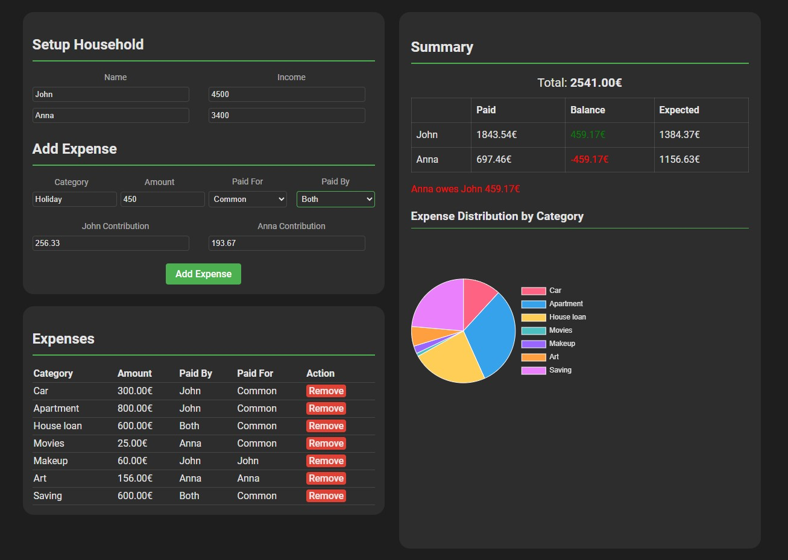

# Household Expense Tracker

A React + TypeScript application for tracking shared household expenses between two people. Features proportional expense splitting, category-based expense tracking, and visual spending analysis.

🚀 **[Live Demo](https://ibosnic00.github.io/household-expenses/)**

> This project was entirely developed using [Cursor](https://cursor.sh/) editor and [Claude](https://www.anthropic.com/claude) AI assistant, showcasing the potential of AI-assisted development.



## Features

- **Household Setup**
  - Set up two household members
  - Input individual incomes for proportional expense splitting

- **Expense Management**
  - Add expenses with categories
  - Specify who paid and who the expense was for
  - Support for common expenses split by income ratio
  - Option for both people contributing to a single expense
  - Remove expenses as needed

- **Expense Analysis**
  - Visual breakdown of expenses by category (pie chart)
  - Summary table showing paid and expected contributions
  - Automatic balance calculation
  - Clear indication of who owes whom

## Usage

1. **Setup Household Members**
   - Enter names and incomes for both household members
   - Income is used to calculate proportional splits for common expenses

2. **Add Expenses**
   - Enter expense category and amount
   - Select who the expense is for (Common or specific person)
   - Choose who paid for the expense
   - For shared payments, enter individual contributions

3. **Track Balances**
   - View the summary table for current balances
   - Check the pie chart for expense distribution by category
   - See who owes money to whom

## Technologies Used

- React
- TypeScript
- Vite
- Chart.js
- CSS3

## Getting Started

1. **Clone the repository**
   ```bash
   git clone https://github.com/ibosnic00/household-expenses.git
   cd household-expenses
   ```

2. **Install dependencies**
   ```bash
   npm install
   ```

4. **Start the development server**
   ```bash
   npm run dev
   ```

The application will be available at [http://localhost:5173](http://localhost:5173)

### Prerequisites

- Node.js (v14.0.0 or higher)
- npm (v6.0.0 or higher)

### Environment Setup

Make sure you have the following installed:
- [Node.js](https://nodejs.org/)
- [npm](https://www.npmjs.com/) (comes with Node.js)
- A modern web browser